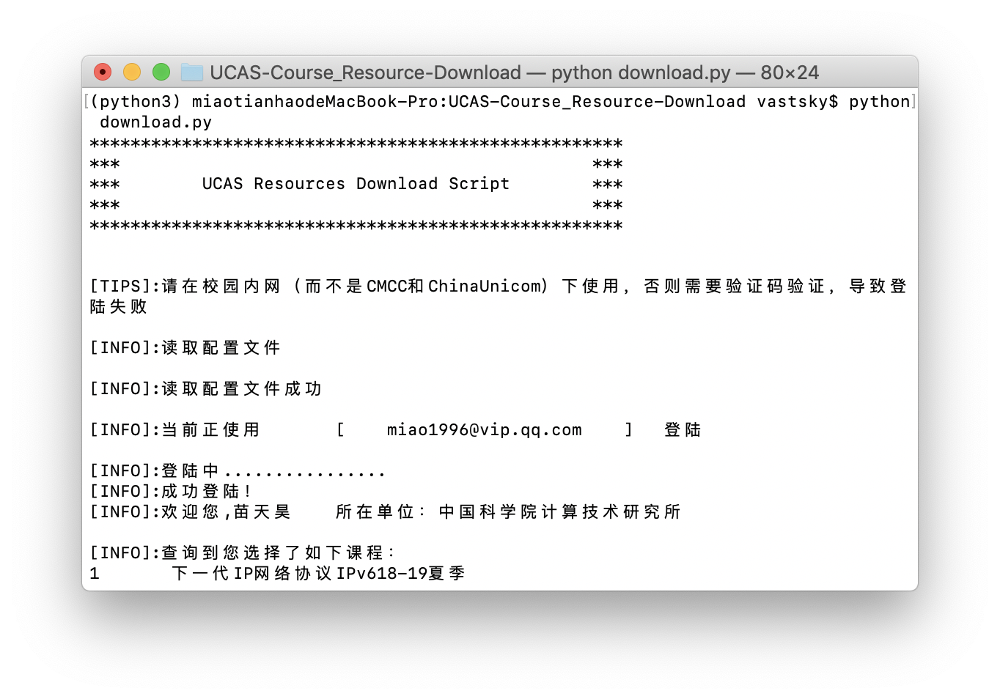
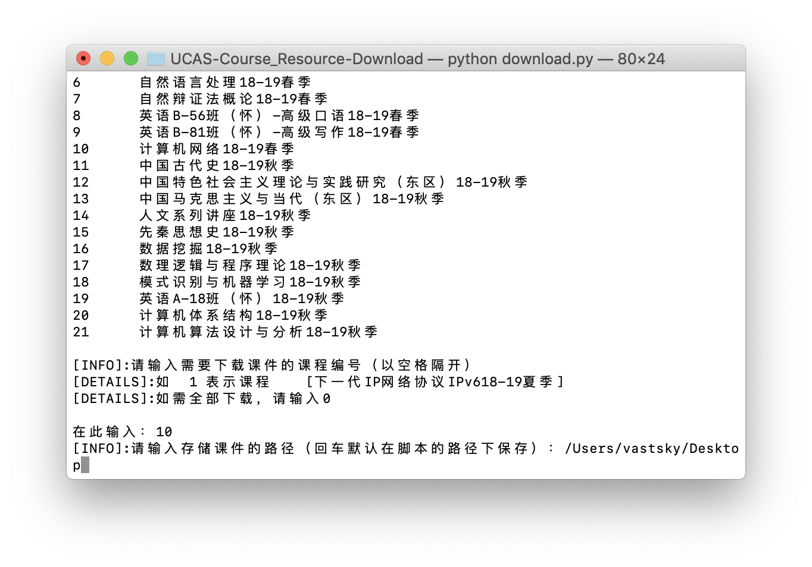
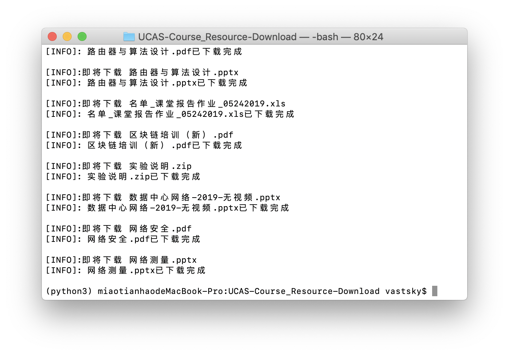

# UCAS-Course_Resource-Download
国科大下载课件脚本
## Requirements 需要环境
python 3.5.6
* configparser
* requests
* bs4

安装上述依赖包  
`pip install configparser`   
`pip install bs4`  
`pip install requests`  

## Run 运行
系统终端执行
`python download.py`  
按照提示输入密码，以及需要下载的课程编号

## TODO
某些课程中文编码为ASCII码，在BeautifulSoup解析时无法正确对html进行解码，导致某些课件名称解析不出来。

## TIPS
用户名和密码保存在本地脚本所在文件夹下的conf.ini内。  
首次运行脚本需要输入密码，再次登陆无需输入。

## 程序截图

  
  
  
